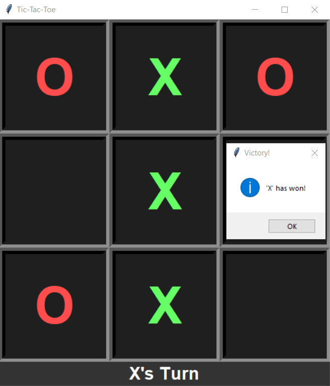

# Tic-Tac-Toe Game

A simple and classic Tic-Tac-Toe game implemented in Python using the Tkinter library. This game features a straightforward interface where two players can take turns playing Tic-Tac-Toe on a 3x3 grid. The game will automatically reset after a win or a draw.

## Features

- **Player Turn**: The game alternates turns between player 'O' and player 'X'.
- **Victory Detection**: Checks for a win or draw condition after every move.
- **Reset Functionality**: Automatically resets the game board after a win or draw.
- **Color Indicators**: Uses different colors to differentiate between players.

## Screenshots

  <!-- Add a screenshot image of your game here -->

## Requirements

- Python 3.x
- Tkinter (usually included with Python standard library)

## Usage

1. **Start the Game:**

   Launch the game by running the `tic_tac_toe.py` script.

2. **Playing:**

   Click on any empty cell to make a move. The game will display a message box when a player wins or the game ends in a draw. The board will automatically reset for a new game.
